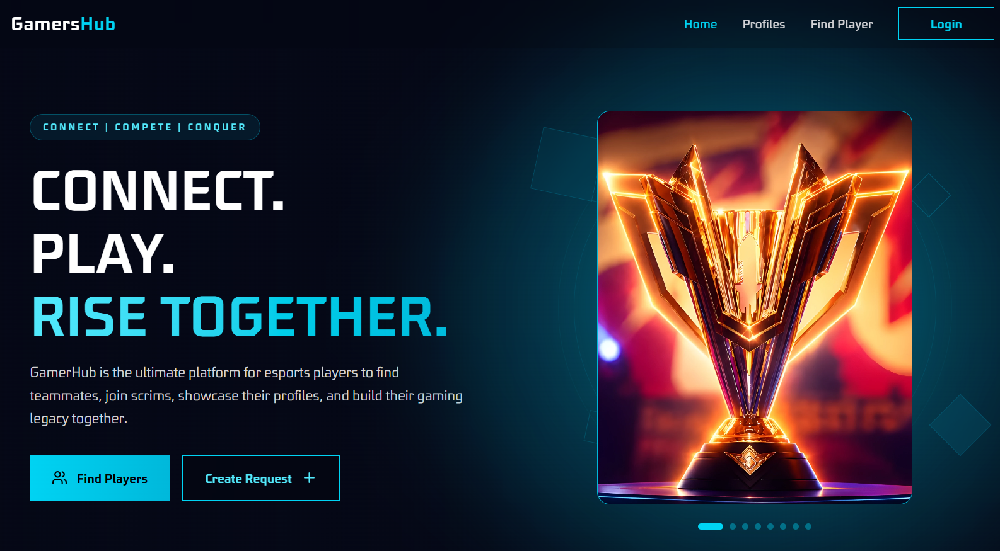
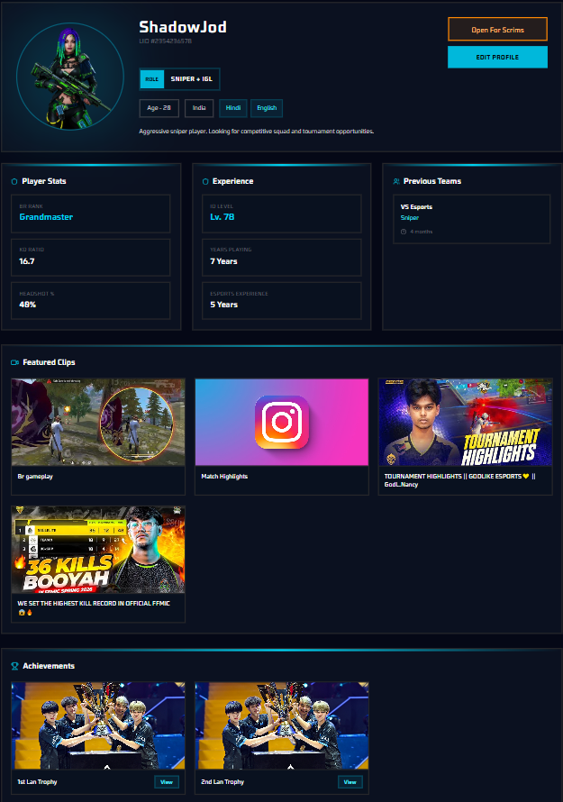
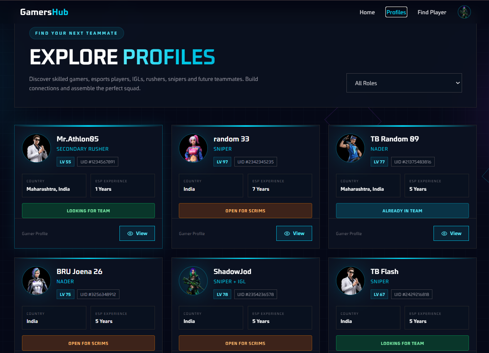
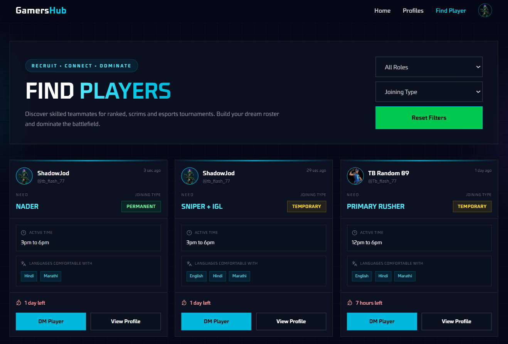

# 🎮 GamersHub Frontend

> A modern esports social platform frontend built with React, Vite, Tailwind CSS, and Authentication.

> ⚠️ **This repository contains only the frontend application.**
>
> Backend Repository:
> https://github.com/nikhilvishwakarma077/gamershub-backend

---

# 🚀 Live Demo

🔗 https://gamershub-ffm.vercel.app/

---

# ✨ Features

- Modern gaming-inspired UI
- Authentication 
- User Profiles
- Banner & Avatar selection
- Cloudinary Image Integration
- Post(Find player) Feed
- Auto delete post feature
- Player Statistics
- Responsive Design
- Protected Routes
- Toast Notifications
- Loading Skeletons
- API Integration
- Optimized Production Build

---

# 🛠 Tech Stack

Frontend

- React
- Typescript
- Vite
- TailwindCSS
- React Router
- Axios
- Cloudinary
- React Hot Toast

Backend

- Node.js
- Express
- MongoDB
- Typescript
- JWT
- Cloudinary

Deployment

- Vercel
- Render

---

# 🏗 Architecture Overview

```
Browser
      │
      ▼
React + Vite
      │
Axios API
      │
      ▼
Express Backend
      │
MongoDB
      │
Cloudinary
```

---

# 📸 Screenshots

## Home



---

## Profile



---

## Feed



---

## Find player feed



---

# 🔗 API

This frontend communicates with:

GamersHub Backend API

Authentication

Profiles

Find Player Posts

Achievements Uploads

---

# 🚀 Future Improvements

- Friend Requests
- Notifications
- Tournament Module
- Leaderboards
- Dark/Light Theme
- Infinite Feed


---

# 📄 License

MIT License

---

# 👨‍💻 Author

Nikhil Vishwakarma

[Portfolio](https://portfolio-nikhil077.vercel.app/)

[GitHub](https://github.com/nikhilvishwakarma077)

[LinkedIn](https://www.linkedin.com/in/nikhil-vishwakarma-874776376)


